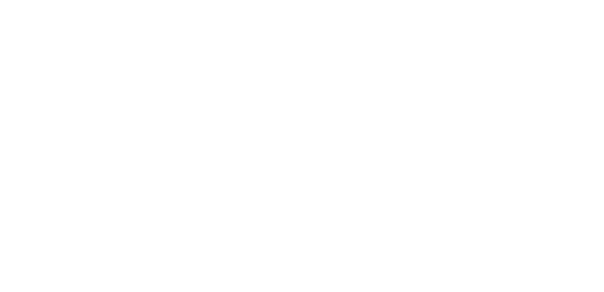

<h1 align="center">Pico 2W Computer Power Controller</h1>

<p align="center">
    
    
    
    <br>
    <a href="https://github.com/Gabi-Zar">
        
    </a>
    
</p>

---

A lightweight MicroPython application for the Raspberry Pi Pico 2W that allows you to remotely power your computer on or off through a secure HTTPS web interface.

## Features

- HTTPS web server
- Password authentication using HMAC-SHA256
- Password is never transmitted over the network
- Replay attack protection using one-time nonces
- Direct connection to the motherboard's power switch (PW+ / PW−)
- Automatic Wi-Fi reconnection
- Lightweight and asynchronous implementation using `uasyncio`

## Required Hardware

- Raspberry Pi Pico 2W (Pico W should also work, but has not been tested)
- PC817 optocoupler (or equivalent)
- 220 Ω, 330 Ω or 470 Ω resistor
- Jumper wires

## Wiring

<p align="center">
    
</p>

The original power button from your computer case can remain connected in parallel with the Pico on PW+ and PW−.

## Setup

### 1. Install MicroPython

Flash the latest MicroPython firmware onto your Pico following the official documentation:

https://www.raspberrypi.com/documentation/microcontrollers/micropython.html

### 2. Generate a self-signed HTTPS certificate

```bash
openssl req -x509 -newkey rsa:2048 -keyout key.pem -out cert.pem -days 3650 -nodes
openssl x509 -in cert.pem -outform DER -out cert.der
openssl rsa -in key.pem -outform DER -out key.der
```

### 3. Configure the project

Create a `config.py` file using `config.example.py` as a template.

### 4. Upload the files

```bash
mpremote fs cp main.py :main.py
mpremote fs cp config.py :config.py
mpremote fs cp cert.der :cert.der
mpremote fs cp key.der :key.der
mpremote reset
```

### 5. View logs

```bash
mpremote resume
```

The web interface is now accessible from your local network using the Pico's IP address.

To access it from outside your network, you can configure port forwarding or place it behind a reverse proxy.

## Security

The web interface is protected using several mechanisms:

- HTTPS encryption
- HMAC-SHA256 authentication
- One-time nonces to prevent replay attacks
- Constant-time HMAC comparison
- Request size limitation

The password is never sent to the Pico. Instead, the browser computes an HMAC of a server-generated nonce using the password as the secret key.

## License

This project is licensed under the [GPL-3.0 license](LICENSE).

---

<p align="center">If you like this app, consider giving it a star on GitHub!</p>
